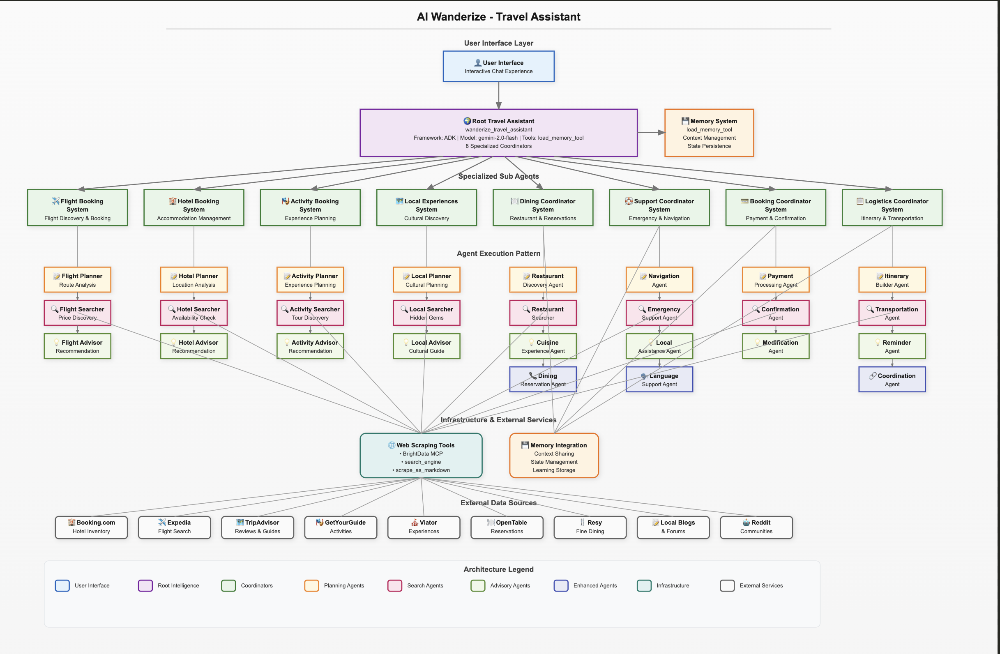
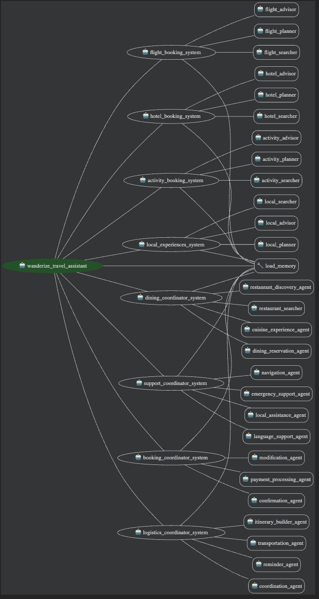

# AI Wanderize

**Intelligent Multi-Agent Travel Planning System**

[](https://google.github.io/adk-docs/)
[](https://brightdata.com/)
[](https://python.org)
[](https://opensource.org/licenses/MIT)



## 🚀 Try AI Wanderize Live

**🌐 Live Demo:** [https://ai-wanderize-913703049174.us-central1.run.app/dev-ui/?app=ai_wanderize](https://ai-wanderize-913703049174.us-central1.run.app/dev-ui/?app=ai_wanderize)

*Experience the power of 35+ AI agents working together to plan your perfect trip!*

## 🎬 AI Wanderize in Action


> **Google Cloud Agent Development Kit Hackathon Submission**  
> **Hackathon URL:** https://googlecloudmultiagents.devpost.com/  
> **Category:** Automation of Complex Processes - Design multi-agent workflows to automate complex, multi-step business processes
> 
> Transform travel planning from hours of research across 38+ websites into a single intelligent conversation.

## 🚀 What is AI Wanderize?

AI Wanderize is an Specialized multi-agent travel planning system that replaces the chaos of traditional travel research with one intelligent conversation. Built on Google's Agent Development Kit (ADK) and powered by real-time web scraping using MCP server, it delivers personalized travel plans with live pricing and authentic local discoveries.

### ✨ Key Features

- **🤖 8 Specialized Agent Systems** - 35+ coordinated AI agents working together
- **🌐 Real-Time Data** - Live pricing and availability through BrightData MCP
- **🏛️ Authentic Local Experiences** - Discover hidden gems locals actually visit
- **⚡ Lightning Fast** - Complete travel plans in 30 seconds vs 1+ hours manual search
- **🎯 Personalized Recommendations** - Tailored to your preferences and budget
- **🔄 Production Ready** - Deployed on Google Cloud Run 

## 🏗️ Architecture

AI Wanderize follows a sophisticated multi-agent architecture pattern:



```
.
├── ai_wanderize
│   ├── __init__.py
│   ├── activity_agent
│   │   ├── __init__.py
│   │   ├── agent.py
│   │   └── prompt.py
│   ├── agent.py
│   ├── booking_agent
│   │   ├── __init__.py
│   │   ├── agent.py
│   │   └── prompt.py
│   ├── config.py
│   ├── dining_agent
│   │   ├── __init__.py
│   │   ├── agent.py
│   │   └── prompt.py
│   ├── flight_agent
│   │   ├── __init__.py
│   │   ├── agent.py
│   │   └── prompt.py
│   ├── hotel_agent
│   │   ├── __init__.py
│   │   ├── agent.py
│   │   └── prompt.py
│   ├── local_experiences_agent
│   │   ├── __init__.py
│   │   ├── agent.py
│   │   └── prompt.py
│   ├── logistics_agent
│   │   ├── __init__.py
│   │   ├── agent.py
│   │   └── prompt.py
│   ├── prompt.py
│   ├── support_agent
│   │   ├── __init__.py
│   │   ├── agent.py
│   │   └── prompt.py
│   └── tools.py
├── ai-diagram.svg
├── deploy.sh
├── Dockerfile
├── LICENSE
└── README.md
```

## 🛠️ Technology Stack

- **Framework**: Google Agent Development Kit (ADK)
- **Language**: Python 3.9+
- **AI Models**: Gemini 2.0 Flash
- **Web Scraping**: BrightData Model Context Protocol (MCP)
- **Deployment**: Google Cloud Run
- **Architecture**: Multi-agent coordination system

## 🎯 Agent Specializations

### 🛫 Flight Agents
- **Flight Planner**: Creates comprehensive flight search strategies
- **Flight Searcher**: Executes real-time flight searches with live pricing
- **Flight Advisor**: Provides destination guides and travel recommendations
- **Flight Coordinator**: Manages complex multi-city and connecting flights

### 🏨 Hotel Agents  
- **Hotel Planner**: Develops targeted accommodation search plans
- **Hotel Searcher**: Finds hotels with real-time rates and availability
- **Hotel Advisor**: Recommends optimal neighborhoods and property types
- **Hotel Coordinator**: Handles group bookings and special requirements

### 🎭 Activity Agents
- **Activity Planner**: Creates activity itineraries based on interests
- **Activity Searcher**: Discovers tours, experiences, and attractions
- **Activity Advisor**: Provides cultural context and recommendations
- **Activity Coordinator**: Schedules and optimizes activity timing

### 🍽️ Dining Agents
- **Dining Planner**: Plans restaurant experiences and food tours
- **Dining Searcher**: Finds authentic local restaurants and hidden gems
- **Dining Advisor**: Provides cultural dining etiquette and recommendations
- **Dining Coordinator**: Manages reservations and dietary requirements
- **Dining Specialist**: Handles special occasions and unique dining experiences

### 🏛️ Local Experiences Agents
- **Local Planner**: Identifies authentic non-touristy experiences
- **Local Searcher**: Discovers hidden gems and local favorites
- **Local Advisor**: Provides cultural immersion recommendations
- **Local Coordinator**: Connects with local guides and communities

### 🆘 Support Agents
- **Support Planner**: Anticipates travel needs and potential issues
- **Support Searcher**: Finds practical travel information and services
- **Support Advisor**: Provides safety, health, and emergency guidance
- **Support Coordinator**: Manages travel documents and requirements
- **Support Specialist**: Handles special assistance and accessibility needs

### 💳 Booking Agents
- **Booking Planner**: Develops booking strategies and timing
- **Booking Processor**: Handles payment processing and confirmations
- **Booking Advisor**: Provides booking recommendations and alternatives
- **Booking Coordinator**: Manages complex multi-service bookings

### 🗺️ Logistics Agents
- **Logistics Planner**: Creates comprehensive travel logistics plans
- **Logistics Coordinator**: Manages transportation between activities
- **Logistics Advisor**: Provides timing and routing recommendations
- **Logistics Optimizer**: Optimizes itineraries for efficiency
- **Logistics Specialist**: Handles complex multi-city logistics

## 🚀 Getting Started

### Prerequisites

- Python 3.9 or higher
- Google Cloud account (for Gemini API)
- BrightData account (for web scraping)

### Installation

1. **Clone the repository**
   ```bash
   git clone https://github.com/arjunprabhulal/ai-wanderize.git
   cd ai-wanderize
   ```

2. **Create virtual environment**
   ```bash
   python -m venv .venv
   source .venv/bin/activate  # On Windows: .venv\Scripts\activate
   ```

3. **Install dependencies**
   ```bash
   pip install google-adk
   ```

4. **Configure environment variables**
   ```bash
   cp .env.example .env
   # Edit .env with your API keys
   ```

5. **Run the system**
   ```bash
   adk web
   ```

### Environment Variables

Create a `.env` file with:

```env
# Google AI Configuration
GOOGLE_API_KEY=your_gemini_api_key
GOOGLE_GENAI_USE_VERTEXAI=false

# BrightData MCP Configuration  
API_TOKEN=your_brightdata_token
WEB_UNLOCKER_ZONE=your_zone
BROWSER_AUTH=your_browser_auth
```

## 💡 Usage Examples

### Basic Travel Planning
```
"Plan a 5-day Tokyo trip for 2 people, budget $3000, interested in authentic local food and unique cultural experiences"
```

### Complex Multi-City Planning
```
"Plan a 2-week Europe trip: London (3 days) → Paris (4 days) → Rome (3 days) → Barcelona (4 days), budget $5000 per person, prefer boutique hotels and local dining experiences"
```

### Specialized Requests
```
"Find authentic local experiences in Bangkok that tourists don't know about, avoiding typical tourist traps, focusing on local markets, street food, and cultural activities"
```

## 🌟 What Makes AI Wanderize Special

### 🎯 **Authentic Local Discovery**
Unlike traditional travel sites that promote tourist traps, AI Wanderize scrapes local blogs, forums, and cultural sites to find experiences that guidebooks miss.

### ⚡ **Real-Time Intelligence**
Live pricing, availability, and recommendations updated in real-time through advanced web scraping technology.

### 🧠 **Multi-Agent Coordination**
40+ specialized agents work together, each bringing domain expertise to create comprehensive travel plans.

### 🎨 **Personalized Experiences**  
Tailored recommendations based on your preferences, budget, travel style, and interests.

### 🔄 **Production Ready**
Enterprise-grade deployment with authentication, monitoring, and scalability built-in.

## Hackathon Category

**Category**: Automation of Complex Processes - Multi-Agent Workflows

**Project Goal**: Automate the complex, multi-step process of travel planning that traditionally requires:
- Visiting multiple different websites
- Hours of research and coordination
- Manual cross-referencing of pricing and availability
- Separate booking and management processes

**Approach**: Multi-agent system that coordinates specialized AI agents to streamline travel planning.

## 🤝 Contributing

We welcome contributions! Please see our [Contributing Guidelines](CONTRIBUTING.md) for details.

1. Fork the repository
2. Create a feature branch (`git checkout -b feature/amazing-feature`)
3. Commit your changes (`git commit -m 'Add amazing feature'`)
4. Push to the branch (`git push origin feature/amazing-feature`)
5. Open a Pull Request

## 📄 License

This project is licensed under the MIT License - see the [LICENSE](LICENSE) file for details.


## 📞 Contact

**Arjun Prabhulal**
- GitHub: [@arjunprabhulal](https://github.com/arjunprabhulal)
- Project: [AI Wanderize](https://github.com/arjunprabhulal/ai-wanderize)

---

**Built with ❤️ using Google's Agent Development Kit**

*Transform your travel planning from chaos to conversation.* 
